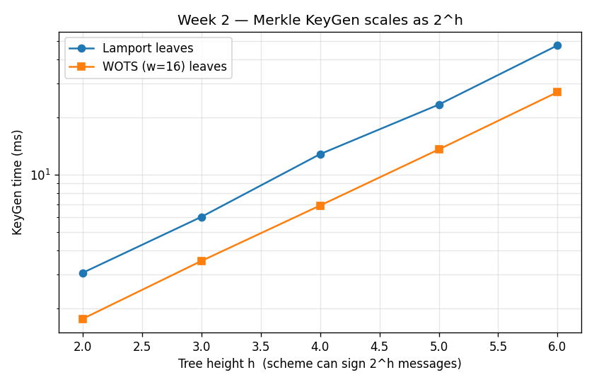
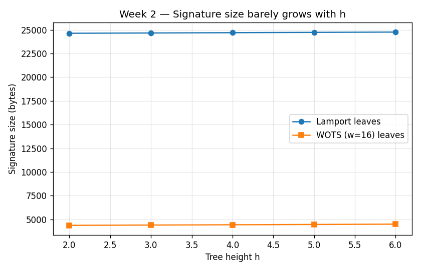

# Post-Quantum Cryptography: Hash-Based Signatures

This project implements and analyzes various hash-based signature schemes, building from basic One-Time Signatures (OTS) to complex Merkle Signature Schemes (MSS).

## Implementation Overview

During **Week 1**, we implemented two primary one-time signature schemes using SHA-256:

- **Lamport OTS**: A classic scheme where each bit of the message hash is signed by revealing one of two secret blocks.
- **Winternitz OTS (WOTS)**: An optimized scheme that uses hash chains to sign multi-bit digits, significantly reducing signature size at the cost of increased computation.

During **Week 2**, we built on top of those one-time schemes to construct a reusable signature scheme:

- **Merkle Signature Scheme (MSS)**: Aggregates `2^h` independent OTS keypairs into a single Merkle tree whose root acts as the long-term public key. Each signature carries an *authentication path* — the sibling hashes along the way from the used leaf up to the root — so the verifier can reconstruct the root from the OTS public key alone. This removes the "one-time" restriction (each leaf is still used only once, but the keypair as a whole signs up to `2^h` messages) at the price of larger keys and a bit of extra signing/verification work. The implementation works on top of either Lamport or WOTS leaves.

## Project Structure
```
crypto_project/
├── src/
│   ├── utils.py               # Hashing and bit manipulation
│   ├── lamport.py             # Lamport OTS implementation
│   ├── wots.py                # Winternitz OTS implementation
│   ├── merkle.py              # Merkle Signature Scheme (Week 2)
│   └── security_simulation.py # Key reuse attack demonstration
├── benchmarks/
│   ├── week1_analysis.py      # Week 1 performance measurement
│   ├── week2_analysis.py      # Week 2 MSS performance measurement
│   ├── plot_week2.py          # Generates the Week 2 plots
│   ├── week2_keygen.png       # Plot: KeyGen time vs tree height
│   ├── week2_signature_size.png # Plot: Signature size vs tree height
│   └── simulation_results.txt # Detailed attack log
├── tests/
│   ├── run_tests.py           # Simple test runner
│   ├── test_ots.py            # Week 1 unit tests
│   └── test_merkle.py         # Week 2 unit tests (Merkle scheme)
├── results.md                 # Detailed performance and security analysis
└── README.md                  # This file
```

## How to Run

### Benchmarking
To compare the performance of Lamport and WOTS:
```bash
python3 benchmarks/week1_analysis.py
```

### Security Simulation
To observe the key reuse vulnerability in Lamport:
```bash
PYTHONPATH=. python3 src/security_simulation.py
```

### Tests
To run the automated test suite:
```bash
python3 tests/run_tests.py
```

To run the Week 2 Merkle tests specifically:
```bash
python3 -m pytest tests/test_merkle.py -v
```

## Week 2 — Merkle Signature Scheme

### What was built
- `src/merkle.py` — `MerkleSignature` class with `generate_keypair`, `sign`, and `verify`. The class is generic over the OTS primitive, so the same Merkle tree can be backed by Lamport or WOTS leaves (`MerkleSignature(height=h, ots_scheme="lamport")` or `MerkleSignature(height=h, ots_scheme="wots", w=16)`).
- `tests/test_merkle.py` — 7 tests covering correctness for both OTS backends, signing every leaf in the tree, exhaustion behavior, tampered messages, tampered authentication paths, and signatures verified against the wrong root. **All 7 pass.**
- `benchmarks/week2_analysis.py` — measures KeyGen, Sign, Verify, and signature size for `h ∈ {2, 4, 6}` over both Lamport and WOTS leaves.
- `benchmarks/plot_week2.py` — produces the two PNGs shown below.

### How to run
```bash
python3 benchmarks/week2_analysis.py     # numeric benchmark
python3 benchmarks/plot_week2.py         # regenerate the plots
python3 -m pytest tests/test_merkle.py   # 7 tests
```

### Results

| Scheme              | Leaves | KeyGen   | Sign    | Verify  | Sig size  |
|---------------------|--------|----------|---------|---------|-----------|
| MSS h=2, Lamport    | 4      | 3.12 ms  | 0.08 ms | 0.18 ms | 24,644 B  |
| MSS h=4, Lamport    | 16     | 12.50 ms | 0.03 ms | 0.17 ms | 24,708 B  |
| MSS h=6, Lamport    | 64     | 49.97 ms | 0.03 ms | 0.18 ms | 24,772 B  |
| MSS h=2, WOTS w=16  | 4      | 1.76 ms  | 0.20 ms | 0.22 ms | 4,356 B   |
| MSS h=4, WOTS w=16  | 16     | 7.12 ms  | 0.23 ms | 0.25 ms | 4,420 B   |
| MSS h=6, WOTS w=16  | 64     | 28.47 ms | 0.24 ms | 0.25 ms | 4,484 B   |





### Key observations
1. **KeyGen scales as `2^h`** — every additional level of the tree doubles the number of OTS keypairs we must materialize. That is the dominant cost of building an MSS keypair.
2. **Sign and Verify are essentially constant in `h`.** They cost one OTS operation plus `h` extra hashes (the authentication path), which is negligible compared to the OTS work itself.
3. **Signature size grows by only `32·h` bytes** — one SHA-256 hash per tree level. Doubling the number of available signatures (going from `h` to `h+1`) costs only 32 additional bytes per signature.
4. **WOTS leaves give ~5.5× smaller signatures** than Lamport leaves (~4.4 KB vs ~24.7 KB at `h=6`), at the cost of ~6× more work per sign/verify. The choice between them is a clean size-vs-speed trade-off.

These observations motivate Week 3 (parameter tuning to find sweet spots for `h` and `w`) and Week 4 (stateless / hypertree constructions that avoid the `O(2^h)` keygen cost).

## Contributors
- **Salwa Laicha** ([@slaicha](https://github.com/slaicha)) — Week 1 (Lamport OTS, WOTS, key-reuse attack demonstration)
- **Abdullah** ([@abdullah-s-94](https://github.com/abdullah-s-94)) — Week 2 (Merkle Signature Scheme, authentication paths, benchmarks and plots)
