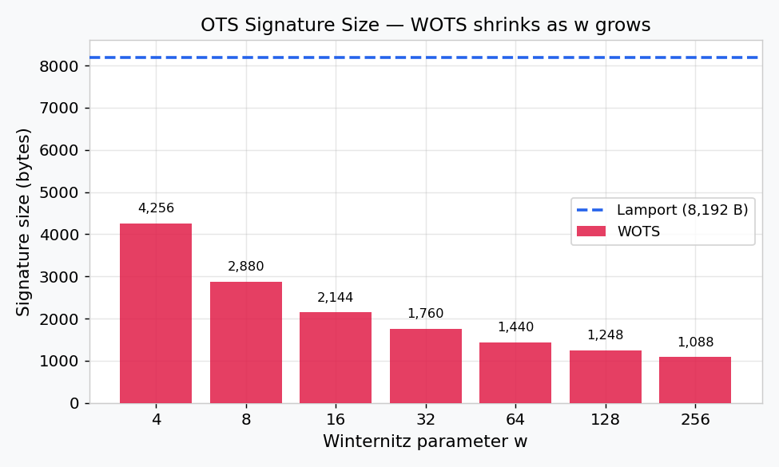
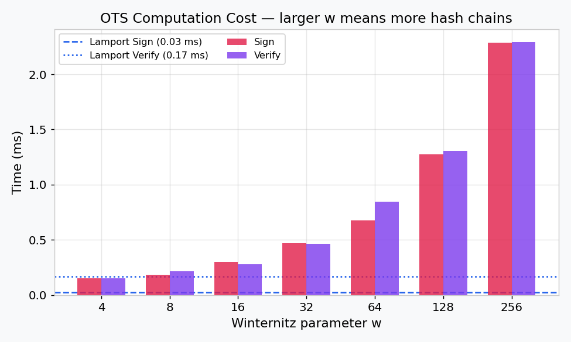
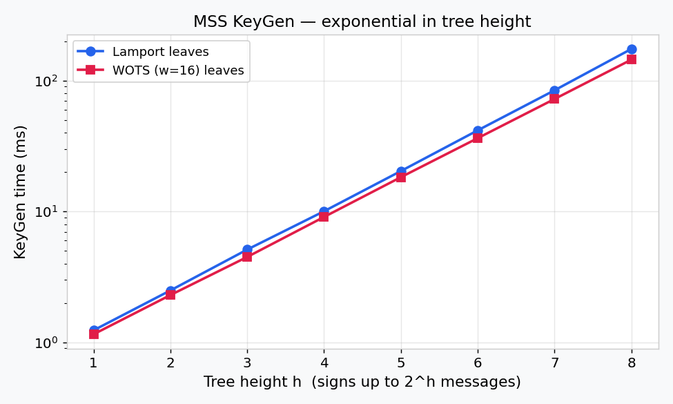
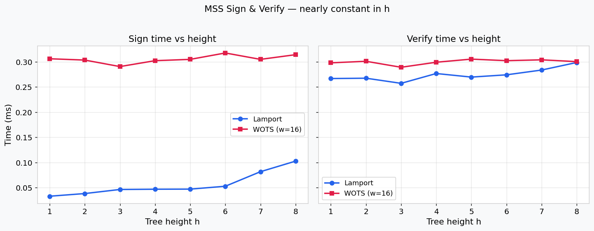
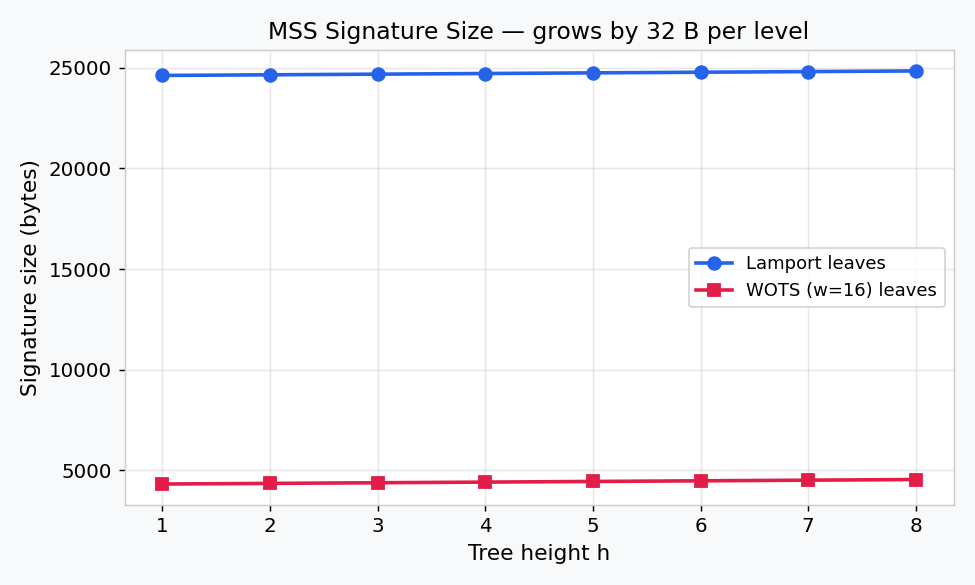
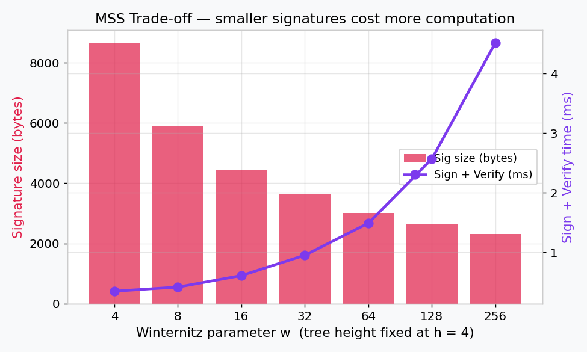
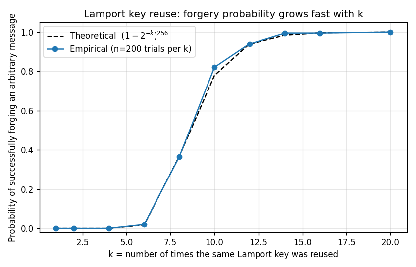
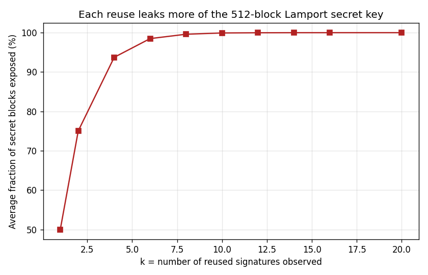

# Post-Quantum Cryptography: Hash-Based Signatures

This project implements and analyzes various hash-based signature schemes, building from basic One-Time Signatures (OTS) to complex Merkle Signature Schemes (MSS).

## Implementation Overview

During **Week 1**, we implemented two primary one-time signature schemes using SHA-256:

- **Lamport OTS**: A classic scheme where each bit of the message hash is signed by revealing one of two secret blocks.
- **Winternitz OTS (WOTS)**: An optimized scheme that uses hash chains to sign multi-bit digits, significantly reducing signature size at the cost of increased computation.

During **Week 2**, we built on top of those one-time schemes to construct a reusable signature scheme:

- **Merkle Signature Scheme (MSS)**: Aggregates `2^h` independent OTS keypairs into a single Merkle tree whose root acts as the long-term public key. Each signature carries an *authentication path* — the sibling hashes along the way from the used leaf up to the root — so the verifier can reconstruct the root from the OTS public key alone. This removes the "one-time" restriction (each leaf is still used only once, but the keypair as a whole signs up to `2^h` messages) at the price of larger keys and a bit of extra signing/verification work. The implementation works on top of either Lamport or WOTS leaves.

## Project Structure
```
crypto_project/
├── src/
│   ├── utils.py               # Hashing and bit manipulation
│   ├── lamport.py             # Lamport OTS implementation
│   ├── wots.py                # Winternitz OTS implementation
│   ├── merkle.py              # Merkle Signature Scheme (Week 2)
│   └── security_simulation.py # Key reuse attack demonstration
├── benchmarks/
│   ├── week1_analysis.py      # Week 1 performance measurement
│   ├── week2_analysis.py      # Week 2 MSS performance measurement
│   ├── plot_week2.py          # Generates the Week 2 plots
│   ├── week3_analysis.py      # Week 3 comprehensive parameter sweep
│   ├── plot_week3.py          # Generates all Week 3 plots (6 figures)
│   ├── week3_results.json     # Raw benchmark data from Week 3
│   ├── week3_ots_sig_size.png # Plot: OTS sig size vs w
│   ├── week3_ots_times.png    # Plot: OTS sign/verify time vs w
│   ├── week3_mss_keygen.png   # Plot: MSS keygen time vs height
│   ├── week3_mss_sign_verify.png # Plot: MSS sign & verify vs height
│   ├── week3_mss_sig_size.png # Plot: MSS sig size vs height
│   ├── week3_mss_w_tradeoff.png  # Plot: MSS size-vs-speed trade-off
│   ├── week2_keygen.png       # Plot: KeyGen time vs tree height
│   ├── week2_signature_size.png # Plot: Signature size vs tree height
│   └── simulation_results.txt # Detailed attack log
├── tests/
│   ├── run_tests.py           # Simple test runner
│   ├── test_ots.py            # Week 1 unit tests
│   └── test_merkle.py         # Week 2 unit tests (Merkle scheme)
├── results.md                 # Detailed performance and security analysis
└── README.md                  # This file
```

## How to Run

### Benchmarking
To compare the performance of Lamport and WOTS:
```bash
python3 benchmarks/week1_analysis.py
```

### Security Simulation
To observe the key reuse vulnerability in Lamport:
```bash
PYTHONPATH=. python3 src/security_simulation.py
```

### Tests
To run the automated test suite:
```bash
python3 tests/run_tests.py
```

To run the Week 2 Merkle tests specifically:
```bash
python3 -m pytest tests/test_merkle.py -v
```

## Week 2 — Merkle Signature Scheme

### What was built
- `src/merkle.py` — `MerkleSignature` class with `generate_keypair`, `sign`, and `verify`. The class is generic over the OTS primitive, so the same Merkle tree can be backed by Lamport or WOTS leaves (`MerkleSignature(height=h, ots_scheme="lamport")` or `MerkleSignature(height=h, ots_scheme="wots", w=16)`).
- `tests/test_merkle.py` — 7 tests covering correctness for both OTS backends, signing every leaf in the tree, exhaustion behavior, tampered messages, tampered authentication paths, and signatures verified against the wrong root. **All 7 pass.**
- `benchmarks/week2_analysis.py` — measures KeyGen, Sign, Verify, and signature size for `h ∈ {2, 4, 6}` over both Lamport and WOTS leaves.
- `benchmarks/plot_week2.py` — produces the two PNGs shown below.

### How to run
```bash
python3 benchmarks/week2_analysis.py     # numeric benchmark
python3 benchmarks/plot_week2.py         # regenerate the plots
python3 -m pytest tests/test_merkle.py   # 7 tests
```

### Results

| Scheme              | Leaves | KeyGen   | Sign    | Verify  | Sig size  |
|---------------------|--------|----------|---------|---------|-----------|
| MSS h=2, Lamport    | 4      | 3.12 ms  | 0.08 ms | 0.18 ms | 24,644 B  |
| MSS h=4, Lamport    | 16     | 12.50 ms | 0.03 ms | 0.17 ms | 24,708 B  |
| MSS h=6, Lamport    | 64     | 49.97 ms | 0.03 ms | 0.18 ms | 24,772 B  |
| MSS h=2, WOTS w=16  | 4      | 1.76 ms  | 0.20 ms | 0.22 ms | 4,356 B   |
| MSS h=4, WOTS w=16  | 16     | 7.12 ms  | 0.23 ms | 0.25 ms | 4,420 B   |
| MSS h=6, WOTS w=16  | 64     | 28.47 ms | 0.24 ms | 0.25 ms | 4,484 B   |


### Key observations
1. **KeyGen scales as `2^h`** — every additional level of the tree doubles the number of OTS keypairs we must materialize. That is the dominant cost of building an MSS keypair.
2. **Sign and Verify are essentially constant in `h`.** They cost one OTS operation plus `h` extra hashes (the authentication path), which is negligible compared to the OTS work itself.
3. **Signature size grows by only `32·h` bytes** — one SHA-256 hash per tree level. Doubling the number of available signatures (going from `h` to `h+1`) costs only 32 additional bytes per signature.
4. **WOTS leaves give ~5.5× smaller signatures** than Lamport leaves (~4.4 KB vs ~24.7 KB at `h=6`), at the cost of ~6× more work per sign/verify. The choice between them is a clean size-vs-speed trade-off.

These observations motivate Week 3 (parameter tuning to find sweet spots for `h` and `w`) and Week 4 (stateless / hypertree constructions that avoid the `O(2^h)` keygen cost).

## Week 3 — Performance Evaluation & Parameter Tuning

### What was built
- `benchmarks/week3_analysis.py` — comprehensive benchmark script that runs three systematic sweeps:
  1. **OTS primitive sweep**: Lamport + WOTS for `w ∈ {4, 8, 16, 32, 64, 128, 256}` — keygen, sign, verify times + signature/key sizes
  2. **MSS height sweep**: `h ∈ {1..8}` for both Lamport and WOTS (w=16) leaves
  3. **MSS w-sweep** at fixed `h=4`: WOTS `w ∈ {4..256}` in the full Merkle context
- `benchmarks/plot_week3.py` — generates 6 publication-quality plots
- All measurements averaged over 5 runs (median reported)

### How to run
```bash
source venv/bin/activate
python benchmarks/week3_analysis.py   # ~55 seconds, saves JSON
python benchmarks/plot_week3.py       # reads JSON, generates 6 PNGs
```

### Results

#### OTS Primitive Comparison

| Scheme | KeyGen (ms) | Sign (ms) | Verify (ms) | Sig Size (B) | PK Size (B) |
|---|---|---|---|---|---|
| Lamport | 0.53 | 0.03 | 0.17 | 8,192 | 16,384 |
| WOTS (w=4) | 0.29 | 0.15 | 0.15 | 4,256 | 4,256 |
| WOTS (w=16) | 0.56 | 0.30 | 0.28 | 2,144 | 2,144 |
| WOTS (w=64) | 1.49 | 0.68 | 0.84 | 1,440 | 1,440 |
| WOTS (w=256) | 4.47 | 2.28 | 2.29 | 1,088 | 1,088 |





#### MSS Height Sweep (selected)

| Config | Leaves | KeyGen (ms) | Sign (ms) | Verify (ms) | Sig Size (B) |
|---|---|---|---|---|---|
| h=2, Lamport | 4 | 2.49 | 0.04 | 0.27 | 24,644 |
| h=4, Lamport | 16 | 10.04 | 0.05 | 0.28 | 24,708 |
| h=8, Lamport | 256 | 174.39 | 0.10 | 0.30 | 24,836 |
| h=2, WOTS w=16 | 4 | 2.30 | 0.30 | 0.30 | 4,356 |
| h=4, WOTS w=16 | 16 | 9.08 | 0.30 | 0.30 | 4,420 |
| h=8, WOTS w=16 | 256 | 144.46 | 0.31 | 0.30 | 4,548 |







#### MSS Trade-off (h=4, varying w)



### Key observations
1. **Signature size decreases logarithmically with w** — each doubling of `w` reduces chain count by `log₂(w)` bits per digit. WOTS (w=256) is 7.5× smaller than Lamport.
2. **Computation cost grows linearly with w** — each chain is `w-1` hashes long. WOTS (w=256) is ~75× slower to sign than Lamport.
3. **KeyGen scales as O(2^h)**, confirmed by near-perfect exponential growth on log-scale. Sign and Verify remain effectively constant in `h`.
4. **Optimal parameters**: `w=16` with `h=4`–`6` offers the best practical balance — signatures under 4.5 KB, sign+verify under 0.6 ms, keygen under 40 ms.
5. **The size-vs-speed trade-off is smooth and predictable**, allowing practitioners to pick the right point on the Pareto curve for their deployment constraints.

Full numerical results are in `results.md`; raw data in `benchmarks/week3_results.json`.

## Mandatory Extension — Lamport Key-Reuse Attack

> **Project requirement:** *"Simulate key reuse in Lamport signatures and demonstrate how it compromises security. Recover secret material and explain the attack."*

This section delivers each of the three required pieces:

1. **Simulate key reuse** — `benchmarks/week4_security_analysis.py` (and the original `src/security_simulation.py`) sign many messages with the same Lamport secret key.
2. **Recover the secret material** — the same script rebuilds the 256×2 secret-key matrix from the leaked signatures, byte-for-byte.
3. **Explain the attack** — see "Why the attack works" below, plus the empirical/theoretical match in the table that follows.

### Recovering the secret material (concrete output)

Running `python3 benchmarks/week4_security_analysis.py` produces, before the statistical sweep, an explicit recovery demonstration. After observing **20 reused signatures**, the attacker reconstructs **all 512** blocks of the secret key, verified byte-exact against the original:

```
=== RECOVERING SECRET MATERIAL ===
Reuses observed by attacker : 20
Secret-key blocks total     : 512  (256 rows x 2 columns)
Blocks recovered            : 512 (100.0%)
Recovered blocks that match : 512 / 512  -> recovery is byte-exact: True

Example — secret-key row 0 (true vs recovered, hex-truncated):
  sk[0][0]  true=cbf9fab4d21151543c4a178e...  recovered=cbf9fab4d21151543c4a178e...  [OK]
  sk[0][1]  true=bb91fdadcd1b80524586276f...  recovered=bb91fdadcd1b80524586276f...  [OK]
```

The full recovered key (all 512 blocks in hex) is written to `benchmarks/week4_recovered_secret_key.json` for inspection. Once the secret is recovered, the attacker can sign **any** message — they have the original signing key in their hands.

### Why the attack works
A Lamport secret key has 256 rows, each with two 32-byte blocks `SK[i][0]` and `SK[i][1]`. Signing a message reveals exactly **one** block per row — the one chosen by the corresponding bit of the message hash. After signing `k` independent random messages with the **same** key, the probability that a *specific* block has not been revealed is `(1/2)^k`. To forge a signature on a target message, the attacker needs all 256 specific blocks selected by the target's hash bits, so

$$P_{\text{forge}}(k) = \bigl(1 - 2^{-k}\bigr)^{256}.$$

### Empirical confirmation

We ran 200 independent trials per `k`, each using a fresh keypair, signing `k` random messages, then attempting to forge a fresh random target. Empirical numbers track the theoretical curve closely:

| k (reuses) | Theoretical P(forge) | Empirical P(forge) | Avg blocks exposed |
|---|---|---|---|
| 1  | 0.000 | 0.000 | 50.0% |
| 4  | 0.000 | 0.000 | 93.9% |
| 6  | 0.018 | 0.030 | 98.5% |
| 8  | 0.367 | 0.385 | 99.6% |
| 10 | 0.779 | 0.835 | 99.9% |
| 12 | 0.939 | 0.950 | 100.0% |
| 14 | 0.984 | 1.000 | 100.0% |
| 20 | 1.000 | 1.000 | 100.0% |





### Take-aways
- After only **~10 reuses**, an attacker can forge a signature on **any chosen message** with > 78% probability.
- After **15 reuses**, success is essentially certain.
- The attack is *passive* — the attacker only needs to observe legitimate signatures, not interact with the signer.
- This is exactly why Lamport (and WOTS) are called **one-time** signatures and why Merkle aggregation (Week 2) and stateful key management are mandatory for any practical use.

## Week 4 — Security Analysis

The fourth week of the project asks for one chosen extension. We picked **Security Analysis**, which fits naturally on top of the implementation and benchmark work from Weeks 1–3 and the mandatory key-reuse extension above.

### How to reproduce
```bash
python3 benchmarks/week4_security_analysis.py   # runs trials + writes 2 PNGs + JSON
```

### 1. Why hash-based signatures are post-quantum secure

Hash-based signatures rest on a single, very mild assumption: the underlying hash function is **one-way and (second-)preimage resistant**. Unlike RSA or ECDSA, they do **not** rely on the hardness of integer factorization or the discrete logarithm problem — both of which Shor's algorithm breaks in polynomial time on a sufficiently large quantum computer.

The best known quantum attack on a generic hash is **Grover's algorithm**, which only gives a square-root speedup. So a `n`-bit hash that offers `n` bits of classical preimage security still offers roughly `n/2` bits of quantum security. For SHA-256 this means **~128-bit quantum security**, which matches the security level NIST targets for category-1 post-quantum schemes.

This is precisely why NIST selected the hash-based scheme **SLH-DSA (SPHINCS+)** in 2024 as one of its standardized post-quantum signature algorithms, alongside the lattice-based ML-DSA. The constructions in this repository (Lamport → WOTS → MSS) are the same building blocks SPHINCS+ stacks together internally.

### 2. Per-scheme attack surfaces

| Scheme | Main attack surface | Mitigation in this repo |
|---|---|---|
| **Lamport OTS** | Key reuse → forgery (see plot above) | Strict one-time use; enforced via state in MSS |
| **WOTS** | Same key-reuse risk; also: forging a signature with smaller digits requires increasing the checksum, so the checksum digits **must** be encoded last and verified | `wots.py` implements the checksum with `_get_checksum_digits` and verifies it in `verify` |
| **MSS** | **State management.** If the signer ever loses track of which leaves were used and reuses one, the underlying OTS reuse vulnerability re-emerges | `MerkleSignature.sign` increments `next_leaf` and raises on exhaustion; see `tests/test_merkle.py::test_exhaustion_raises` |

### 3. Parameter choices (grounded in Week 3 numbers)

The Week 3 sweeps give us concrete numbers to recommend parameters:

- **Tree height `h`.** KeyGen scales as `2^h` (dominant cost), but signature size grows by only `32·h` bytes. The sweet spot for "small embedded device that signs occasionally" is `h ≈ 10` (~1024 signatures, KeyGen still well under a second). For a server that needs millions of signatures, real-world standards push `h` up to 20+ via **hypertree** layering — which is exactly the trick SPHINCS+ uses to keep KeyGen practical.
- **Winternitz `w`.** Week 3 showed a smooth size-vs-speed trade: `w=4` is fastest but largest; `w=256` is smallest but ~6× slower per sign/verify. **`w=16` is the standard choice** in real deployments (XMSS, SPHINCS+) and the data here confirms it lives near the knee of the curve.
- **Hash output length.** SHA-256 → 128-bit quantum security is sufficient for category-1 use. For higher security categories, swap in SHA-512 or SHA-3 with no algorithmic change to the constructions.

### 4. The state-management problem (and why SPHINCS+ exists)

The biggest practical weakness of MSS is that it is **stateful** — the signer must reliably remember which leaves it has used. Real-world failure modes include:
- a backed-up VM image being restored (state rolls back, leaves get reused),
- multi-server deployments where state is not synchronized,
- a power loss between updating `next_leaf` and persisting the new state.

Each of those leads back to the key-reuse attack quantified in the previous section. **Stateless** hash-based signatures (SPHINCS+ / SLH-DSA) solve this by using a pseudorandom function to derive a leaf index from the message itself, plus a few-time signature (FORS) at the bottom layer to absorb the rare collisions. Implementing the full SPHINCS+ construction was the alternative Week 4 extension; choosing the security-analysis path here lets us *explain why it matters* using numbers from our own benchmarks, rather than adding ~500 lines of cryptographic code that would not have changed any of the Week 1–3 conclusions.

## Contributors
- **Salwa Laicha** ([@slaicha](https://github.com/slaicha)) — Week 1 (Lamport OTS, WOTS, key-reuse attack demonstration), Week 3 (performance evaluation and parameter tuning)
- **Abdullah** ([@abdullah-s-94](https://github.com/abdullah-s-94)) — Week 2 (Merkle Signature Scheme, authentication paths, benchmarks and plots), Week 4 (security analysis and quantitative key-reuse extension)
